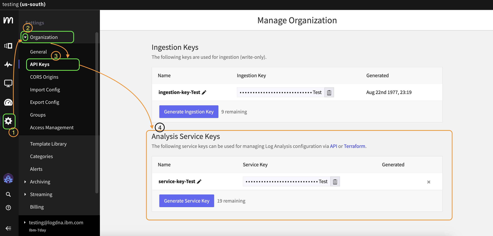

# IBM Log Analysis Log Export Tool

This project contains two tools to export logs from IBM Log Analysis.

1. [IBMLogAnalysisExportLogs.py](https://github.com/avinashkarhana/ibm-log-analysis-log-export/tree/main/python-based) - A Python-based Log Export Tool for IBM Log Analysis.

2. [IBMLogAnalysisExportLogs.user.js](https://github.com/avinashkarhana/ibm-log-analysis-log-export/tree/main/js-userscript) - A JavaScript-based Browser embedded Log Export Tool for IBM Log Analysis.

## Recommendation

Both tools have their own pros and cons, and it is recommended to use the tool which suits your needs.

> > Both the tools supports exporting logs in multiple formats Plain-Text, JSON, CSV, and EXCEL(XLSX).

### Python based tool

- It is more reliable than the JavaScript based tool as it do not rely on UI for configuration.

- But it requires Python to be installed on the machine, and it relies on the Service_ID/Key and configurations to be stored in the `config.py` file. Hence, changing the configuration requires manually editing the `config.py` file every time you need new logs

> Verdict: Recommended for advanced users, or if JavaScript based tool does not work for you

### JavaScript based tool

- It is more easy to use as it is embedded in the browser and can be used just as an extension to the IBM Log Analysis UI.

- This tool also does not require any manual editing of files.

- This tool does not store any sensitive information on disk and asks for Service_ID/Key on every reload of the page.

- Log Export works with a single button click after selecting appropriate options/filters/time-frame, as usual on UI.

- Easy to install (Few clicks install) and use.

- It might take longer to collect longs for a very long time frame as the native browser-based zipping takes time

- But it is less reliable than the Python based tool as it relies on the UI elements of IBM Log Analysis (Which might change in future).

- This tool also requires the user to install a browser extension (TamperMonkey) to work.

> Verdict: Recommended for most users due to ease of use and no manual editing of files, and almost no pre-setup required apart from the tamper-monkey extension.

## Process to get the Service_ID/Key

An Admin user can get the Service_ID/Key from the IBM Log Analysis UI.

To get the Service_ID/Key, follow the below steps:

1. Login to IBM Log Analysis UI.
2. Go to `Settings` by clicking on the gear icon on left panel.
3. Expand the `Organization` section.
4. Click on `API Keys`.
5. Use `Analysis Service Keys` section, to get existing service keys or generate new service keys.

> Keep a note of the Service_ID/Key somewhere safe as you will need this to export logs using the tools

## Do you Want to help me to work more on Open-Source Projects like this?
 so that I can get one more sleepless night to work on this kind of stuff.

Or use other sponsoring methods if you like.
